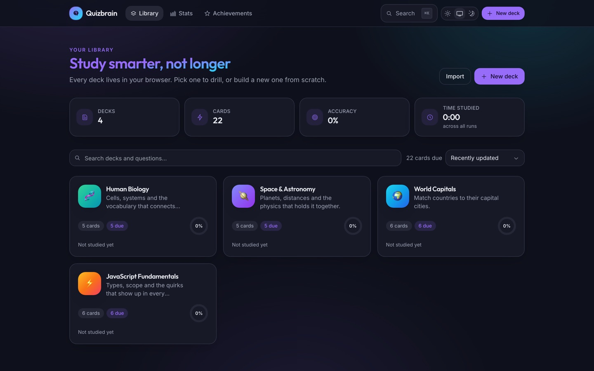
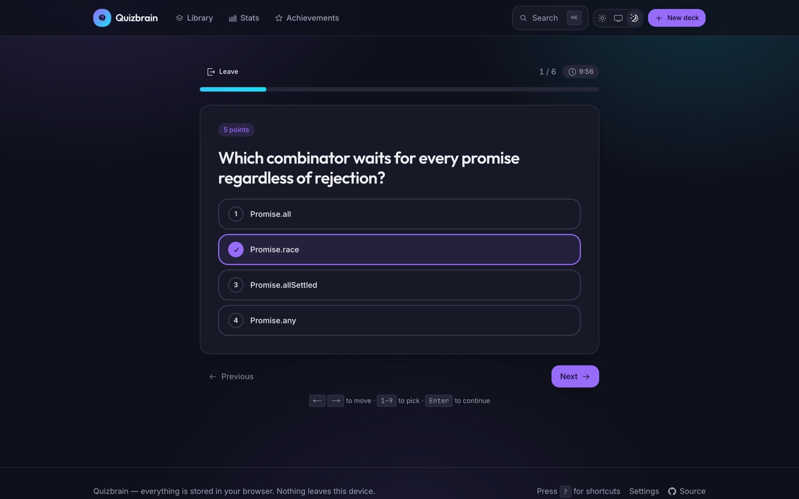
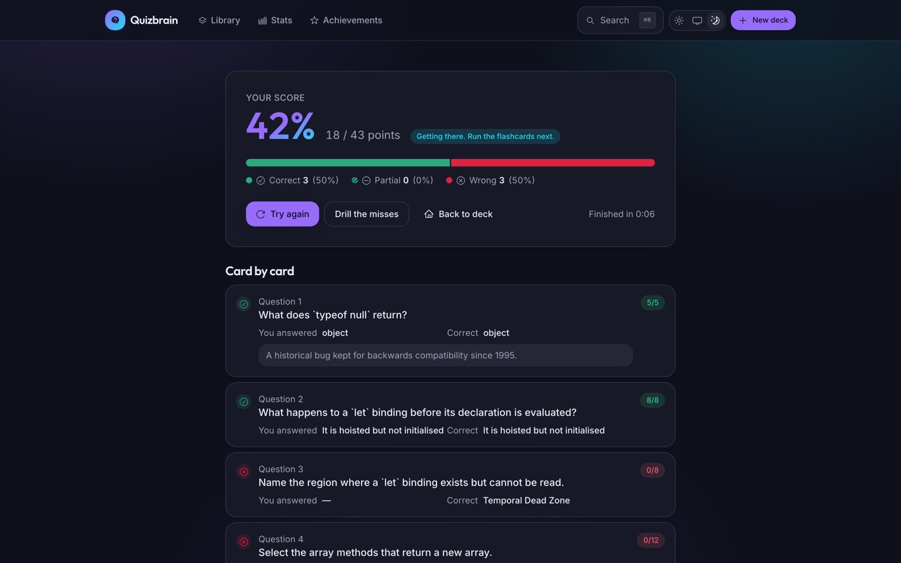
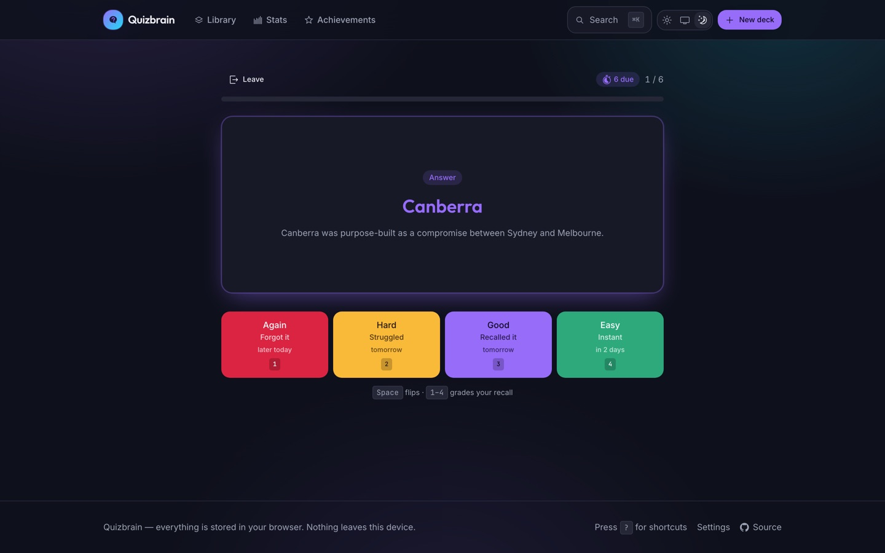
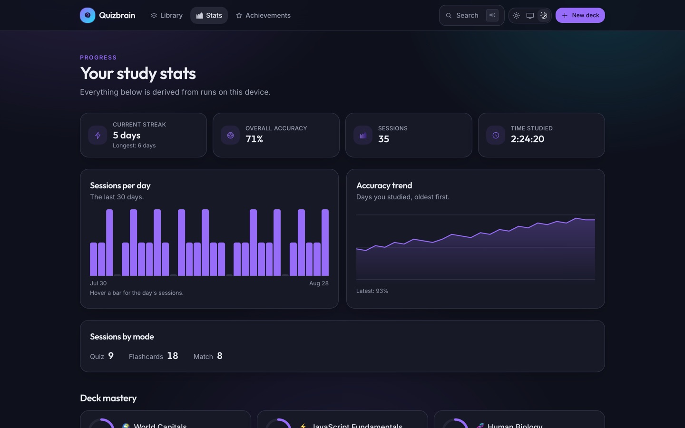
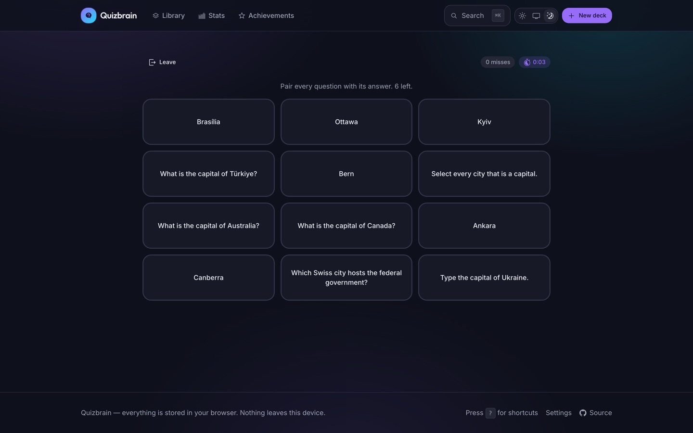
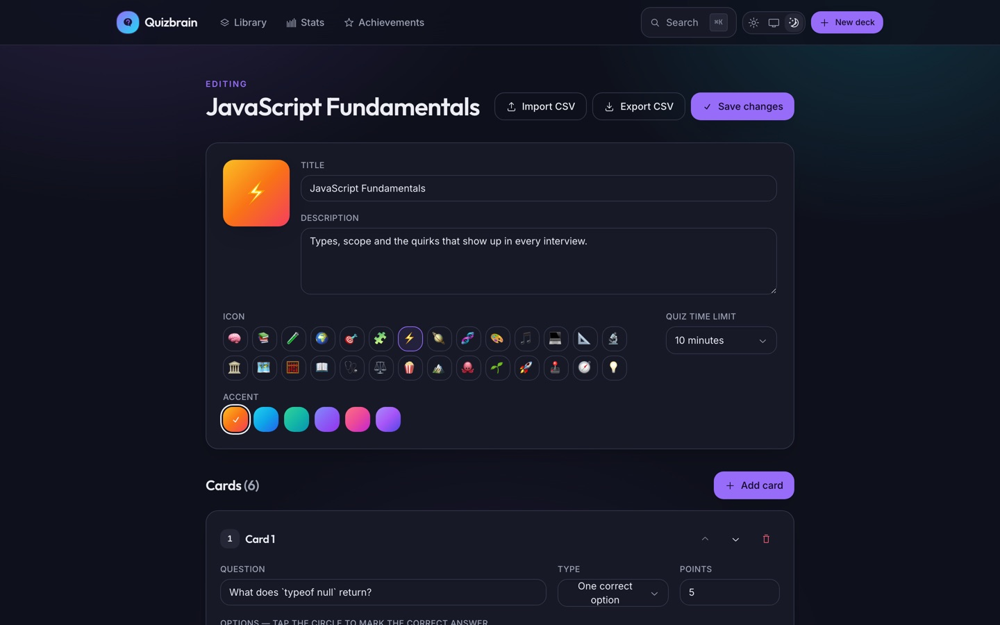
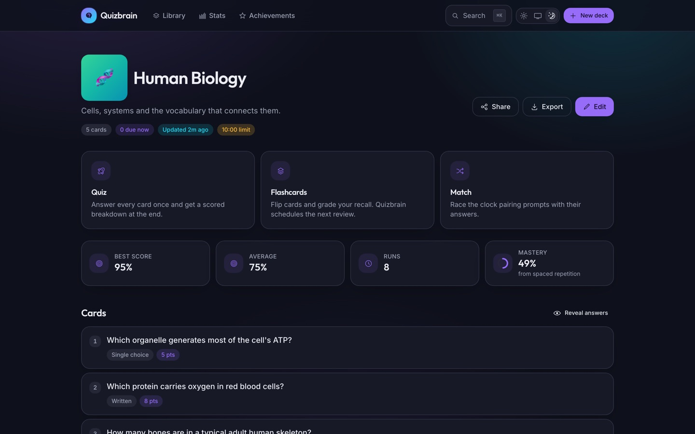
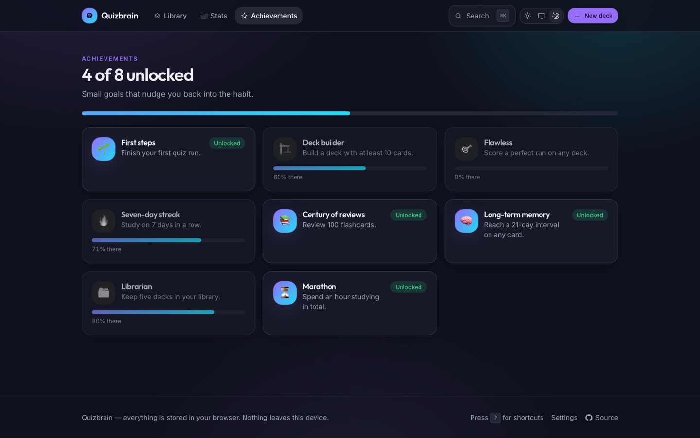
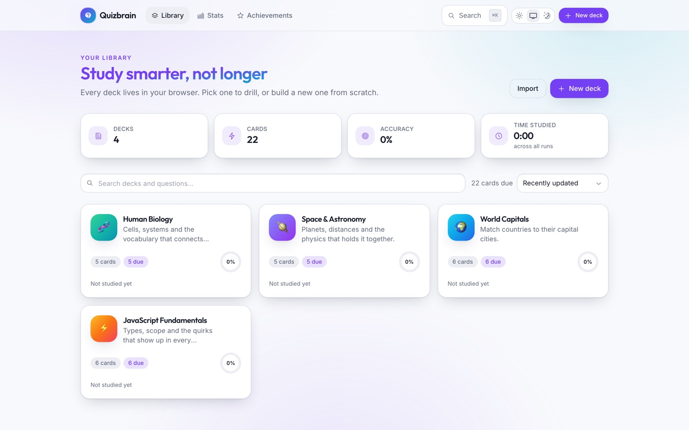

<div align="center">

# 🧠 Quizbrain

**Build decks, drill them three different ways, and let spaced repetition decide what you see next.**

An offline-first study app built with the Next.js App Router. Everything lives in your browser —
there is no account, no backend and no telemetry.

[](https://nextjs.org)
[](https://www.typescriptlang.org)
[](https://tailwindcss.com)
[](https://vitest.dev)
[](LICENSE)

</div>

<p align="center">
  
</p>

---

## What it does

| Mode           | What it is                                                           | Good for                          |
| -------------- | -------------------------------------------------------------------- | --------------------------------- |
| **Quiz**       | Every card once, timed, then a scored breakdown with per-card review | Checking where you actually stand |
| **Flashcards** | Flip and self-grade; an SM-2 scheduler picks the next review date    | Long-term retention               |
| **Match**      | Race the clock pairing prompts with answers                          | Warming up, and speed recall      |

### Three question types

- **One correct option** — classic single choice.
- **Multiple answers** — graded with partial credit: each right pick earns a share of the points and
  each wrong pick cancels one out, so selecting everything scores zero.
- **Written answer** — normalised comparison (case, accents and punctuation folded away) with a
  length-scaled typo budget, plus a list of alternate spellings you can accept explicitly.

### And the rest

- 🔁 **Spaced repetition** — an SM-2 scheduler with easiness drift, lapses and per-deck mastery rings.
- 📊 **Stats** — streaks, a 30-day activity chart and an accuracy trend, all drawn as hand-rolled
  SVG (no charting dependency).
- 🏆 **Achievements** — eight goals with visible progress toward each.
- ⌘ **Command palette** — `⌘K` (or `/`) to jump to any deck or page.
- ⌨️ **Keyboard-first quizzes** — `1`–`9` picks an option, `←`/`→` moves, `Enter` continues;
  `Space` flips a flashcard and `1`–`4` grades it.
- 🌗 **Light, dark and system themes** — with an inline boot script, so there is no flash on reload.
- 📤 **Import & export** — share a deck as a link (the payload rides in the URL fragment, so it never
  reaches a server log), or move decks in and out as JSON and CSV.
- 💾 **Backup & restore** — download the whole library as JSON and load it back on another machine.
- ♿ **Accessible** — semantic landmarks, a skip link, visible focus rings, `aria-live` regions on
  the charts, and a `prefers-reduced-motion` fallback.

## A look around

<table>
  <tr>
    <td width="50%"></td>
    <td width="50%"></td>
  </tr>
  <tr>
    <td><b>Quiz</b> — numbered options, a countdown and a progress bar.</td>
    <td><b>Results</b> — hero score, part-to-whole breakdown, card-by-card review.</td>
  </tr>
  <tr>
    <td></td>
    <td></td>
  </tr>
  <tr>
    <td><b>Flashcards</b> — flip, then grade; each button shows when the card returns.</td>
    <td><b>Stats</b> — streak, sessions per day and the accuracy trend.</td>
  </tr>
  <tr>
    <td></td>
    <td></td>
  </tr>
  <tr>
    <td><b>Match</b> — pair prompts with answers against the clock.</td>
    <td><b>Editor</b> — build a deck, or import one from CSV.</td>
  </tr>
  <tr>
    <td></td>
    <td></td>
  </tr>
  <tr>
    <td><b>Deck overview</b> — launch any mode, or reveal the answer key.</td>
    <td><b>Achievements</b> — eight goals, each with visible progress.</td>
  </tr>
</table>

Every screen is built from the same token set, so light mode is a real design rather than an inverted
one:

<p align="center">
  
</p>

## Getting started

```bash
pnpm install
pnpm dev
```

Open [localhost:3000](http://localhost:3000). The library seeds itself with four starter decks the
first time you visit; a library saved by an earlier version of this app is migrated automatically.

### Scripts

| Command              | What it does                 |
| -------------------- | ---------------------------- |
| `pnpm dev`           | Development server           |
| `pnpm build`         | Production build             |
| `pnpm test`          | Run the unit tests           |
| `pnpm test:coverage` | Tests with a coverage report |
| `pnpm typecheck`     | `tsc --noEmit`               |
| `pnpm lint`          | ESLint                       |
| `pnpm format`        | Prettier                     |

## How it is put together

```
src/
├── app/                  # App Router routes — every page is a thin shell
│   ├── decks/[deckId]/   # detail · quiz · flashcards · match · edit
│   ├── achievements/ · import/ · settings/ · stats/
│   └── error.tsx · loading.tsx · not-found.tsx
├── components/
│   ├── ui/               # design-system primitives over Radix
│   ├── charts/           # SVG charts, no dependency
│   ├── decks/ · quiz/ · study/ · match/ · stats/ · settings/
│   └── shared/           # shell, header, command menu, theme
├── hooks/                # useHotkey · useDigitKeys · useCountdown
├── lib/                  # the whole domain layer, framework-free
└── store/                # useSyncExternalStore over localStorage
```

**The domain layer has no React in it.** Scoring, the SM-2 scheduler, statistics, CSV, share-link
encoding and validation are plain functions in `src/lib`, which is why they can be tested directly:

```bash
pnpm test
```

**State** is a small store built on `useSyncExternalStore`, not a library. Selectors are memoised on
the identity of the state object, so a selector that derives a new object each call still produces a
referentially stable snapshot.

**Persistence** is versioned and validated. Everything read out of `localStorage` goes through a Zod
schema, and a payload written by the pre-1.0 version of this app is migrated to the current shape on
first load. Anything unrecognised is rejected rather than coerced into an empty library.

**Colour** in the charts is not the UI's status palette reused: light and dark each get their own
steps, chosen so adjacent marks stay separable under deuteranopia and protanopia, with partial credit
carried by a hatch rather than a third hue.

## Data model

```ts
Deck   { id, title, description, emoji, accent, timeLimit, cards[], createdAt, updatedAt }
Card   { id, type: "single" | "multi" | "text", prompt, options[], answers[], accepted[],
         points, hint, explanation }
Attempt{ id, deckId, mode, score, maxScore, durationMs, finishedAt, responses[] }
Review { deckId, cardId, ease, interval, due, repetitions, lapses, reviewedCount }
```

## Licence

[MIT](LICENSE) © paliibo
